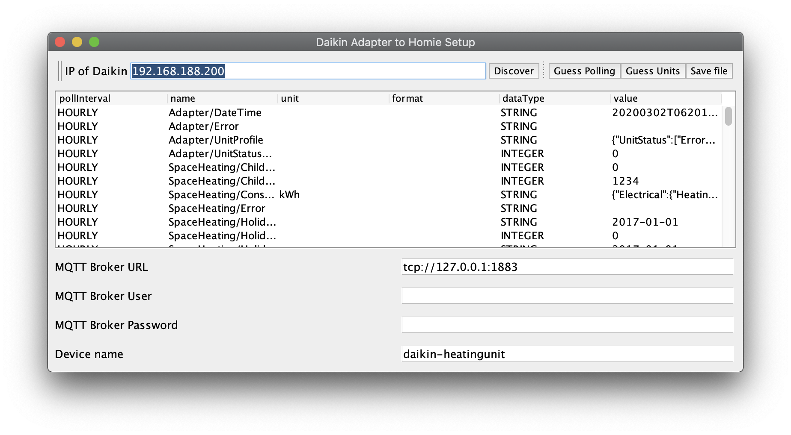

This software allows to discover a Daikin Adapter BRP069A62 in the network and read its endpoints. It will then publish it to an MQTT server according to the homie convention. This software is in its early stage, so please be careful when using it!

## Launching it

You can launch it with `java -jar daikin-0.0.4.jar` which will give you a few options.

If you don't know your IP address you can run `

Once the proper UI opens you can hit the discover button which will try to identify all possible endpoints that can be read from this adapter. For this it will use the UnitProfile endpoint, as well as a text file with some other endpoints that I found in the app.
*ADVANCED: You can also try your own endpoints with the `-e` option*

Once all endpoints have been discovered (which may take a minute) the table for editing information should be filled. 



## Table columns

**Pollinterval** allows you to set how often things are read. You can get some of my preferred values by hitting the `Guess polling` button. But please double check if it is what you would expect and let me know if not.

* NEVER items will be ignored and never read
* ONCE items will be read only during startup. This is useful for things like Hardware version which will very like never change, but it is nice to have it available
* MINUTELY items will be read every minute
* HOURLY items will be read every hour
* BI_HOURLY items will be read ever other hour
* DAILY items will be read every 24h

Currently the polling interval is relative to the start time of the polling (`-p` option).

**Name** is a human readable name that will appear in a homie client.

**Unit** is the physical unit of that property. You can hit the `guess units` button and I set °C to all items ending in temperature. For some other items I can actually read out the unit from the unitprofile.

**Format** allows to specify the range of expected values. For numbers that is `min:max` for enums `on, off,explode`. See the homie convention for more information.

**DataType** is GUESSED from the current value. This may be WRONG! for example the temperature may be exactly 22°C during reading, but the unit can actually provide 22,1°C. So if you know that this field is not integer, change it to float or string.

**Value** If you hit discover you get the current value for information, this allows you make a better assessment of the data type or the expected values.

**postProcessing** there is now a functionality that allows to map the contents of consumption to homie endpoints. 

* NONE does nothing
* CONSUMPTION This parses the json of a consumption string and splits it into sub properties. This enables the presentation of power without having to parse the json. The property: `homie/daikin-heatingunit/domestichotwatertank/2-consumption-electrical-heating-d-0` represents the 0th element in the D array with D meaning daily, W weekly and M monthly. The daily values are for 2 hours, which means element 0 represents the day before today at 0:00, whereas d-1 would be the day before today at 2:00. D-12 is the value of today at 0:00. For weekly the first 7 days represent last month, and for monthly the first 12 month represent last year.

## Final steps in GUI
At the bottom you can find some inputs related to the MQTT settings. The device name must match the homie convention which is lower-case [a-z0-9]+.

The last step of the GUI is to write the config file which is done by the `save file` button. The default name is `PollingSettings.json`

If you don't like GUIs you can run ` java -jar daikin-0.0.4.jar -w 192.168.188.200` which will scan the given IP address and write a `PollingSettings.json` file that you can edit.

## Running the polling service
Now that you have a proper `PollingSettings.json` you can finally launch ` java -jar daikin-0.0.4.jar -p` which will start the polling and update the data in the homie convention. It is recommended to run this as a systemd service. This may look like this:

```
[Unit]
Description=Tool for reading the Daikin Service API
Wants=mosquitto.service
After=mosquitto.service

[Service]
Type=simple
ExecStart=/usr/lib/jvm/java-1.14.0-openjdk-amd64/bin/java -jar /etc/openhab2/scripts/daikin-0.0.2.jar -c /etc/openhab2/scripts/PollingSettings.json -p

[Install]
WantedBy=multi-user.target
```

## Integration into OpenHab
OpenHab has the ability to discover homie convention items. For this the [MQTT Binding](https://www.openhab.org/addons/bindings/mqtt/) needs to be enabled. Please ensure that the broker thing that is added has QoS 1. Once the broker has been added new things should be discovered automatically and can be added.

# Enabling setting values
**WARNING** Setting wrong values may break your device, I take **NO Responsibilty** for any damages that occurred. In order to set a value, open the json file and lookup the property and change `"settable": false,` to `true`. Setting the value is done according to the homie convention. 

## Setting json values
It is also possible to update json values, like a heating plan. In order to set any string, it is important to put `"` at the beginning and the end of the string. It is also important to escape all `"` with `\"`. So an update to the plan that should result in:

```json
{
  "data": [
    "$NULL|1|0700,230;2100,210;,;,;,;,;0700,230;2100,210;,;,;,;,;0700,230;2100,210;,;,;,;,;0700,230;2100,210;,;,;,;,;0700,230;2100,210;,;,;,;,;0700,230;2100,210;,;,;,;,;0700,230;2100,200;,;,;,;,",
    "$NULL|1|,;,;,;,;,;,;,;,;,;,;,;,;,;,;,;,;,;,;,;,;,;,;,;,;,;,;,;,;,;,;,;,;,;,;,;,;,;,;,;,;,;,",
    "$NULL|1|,;,;,;,;,;,;,;,;,;,;,;,;,;,;,;,;,;,;,;,;,;,;,;,;,;,;,;,;,;,;,;,;,;,;,;,;,;,;,;,;,;,"
  ]
}
```

Needs to be escaped to:

```json
"{\"data\":[\"$NULL|1|0700,230;2100,210;,;,;,;,;0700,230;2100,210;,;,;,;,;0700,230;2100,210;,;,;,;,;0700,230;2100,210;,;,;,;,;0700,230;2100,210;,;,;,;,;0700,230;2100,210;,;,;,;,;0700,230;2100,200;,;,;,;,\",\"$NULL|1|,;,;,;,;,;,;,;,;,;,;,;,;,;,;,;,;,;,;,;,;,;,;,;,;,;,;,;,;,;,;,;,;,;,;,;,;,;,;,;,;,;,\",\"$NULL|1|,;,;,;,;,;,;,;,;,;,;,;,;,;,;,;,;,;,;,;,;,;,;,;,;,;,;,;,;,;,;,;,;,;,;,;,;,;,;,;,;,;,\"]}"
```

## PowerFul mode example 
First modify the settings json file by changing `settable` to `true`. The relevant part should now look like this:
```json
...
    {
      "path": "2/Operation/Powerful",
      "groupName": "DomesticHotWaterTank",
      "name": "DomesticHotWaterTank/Operation/Powerful",
      "settable": true,
      "retained": true,
      "unit": "",
      "format": "",
      "pollInterval": "MINUTELY",
      "dataType": "INTEGER",
      "postProcessing": "NONE"
    },
...
```

After settable was changed to `true` in the settings file you can check `homie/daikin-heatingunit/domestichotwatertank/2-operation-powerful/$settable` to ensure that the setting was correctly enabled. If you now want to enable the PowerFul mode, you have to write a `1` to the topic `homie/daikin-heatingunit/domestichotwatertank/2-operation-powerful/set`. Writing it will simply trigger the PowerFul mode, and once the temperature has been reached, it will disable itself. However the set-topic will remain `1`, but it is possible to simply write a `1` again.

# Advanced things
## Support for a influx line protocol topic
It is possible to also get an influx line protocol valued topic. This can be directly inserted into an influx DB. There are three properties to be defined in the root node of the json file:

* influxTopic: the topic where the influx data will be posted to
* influxTable: the measurement where the data should be inserted
* influxQFN: the value of the tag qfn
